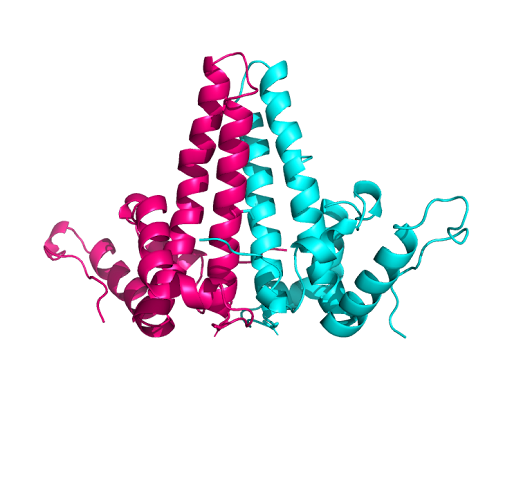
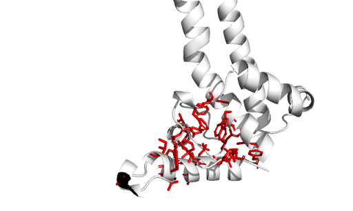
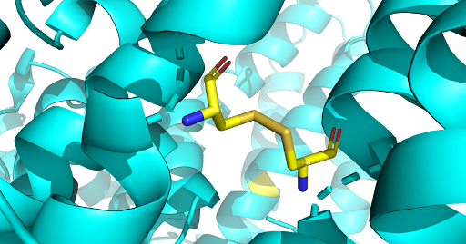

# Structural Analysis of Hepatitis B Capsid Protein (HBcAg)

## Overview
This project investigates the structure and function of the Hepatitis B virus capsid protein (HBcAg) using bioinformatics and structural biology approaches.

The HBcAg protein is essential for viral replication, as it self-assembles into an icosahedral capsid that protects and transports the viral genome.

---

## Project Components

### 1. Protein Function Analysis
- Characterization of HBcAg role in the viral life cycle
- Description of capsid assembly and genome encapsulation
- Analysis of the F97L mutation and its effect on viral assembly

### 2. Sequence Analysis
- Identification of protein domains using PFAM and HMMER
- Multiple sequence alignment across genotypes and species
- Detection of conserved regions (e.g., cysteine residues)
- Phylogenetic analysis of HBV variants

### 3. Structural Analysis
- Structural comparison of HBcAg proteins from different species
- RMSD-based structural superposition
- Identification of conserved structural regions
- Homology modeling of mutant proteins (Modeller)
- Structural evaluation using QMEAN

---

## Key Findings

- HBcAg structure is highly conserved across species despite sequence variability  
- Conserved cysteine residues play a critical role in capsid stability  
- The hydrophobic core is essential for maintaining protein structure  
- Mutation F97L enhances capsid assembly efficiency without major structural changes  
- Structural conservation is stronger than sequence conservation  

---

## Methods & Tools

- **Sequence analysis:** PSI-BLAST, HMMER, ClustalW  
- **Structural analysis:** PyMOL, PDB  
- **Modeling:** Modeller  
- **Validation:** QMEAN  

---

## Repository Structure

```text
.
├── figures/          # Selected PyMOL and analysis figures
├── report/           # Final project report
├── presentation/     # Project presentation
└── README.md
```

---

## Example Figures

### Capsid Dimer


### Hydrophobic Core


### Conserved Disulfide Bonds


---

## Notes

This repository contains selected analyses, figures, and documentation from a structural bioinformatics project focused on HBV capsid proteins. Intermediate outputs and raw files have been omitted for clarity.


## Authors

- Òscar Contreras Parejo
- Alessandra Bonilla
- Marc J. Torres
